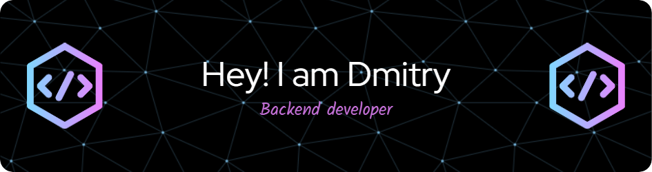

- 👨‍🎓 I’m 20 years old
- 🎓 I'm a student at [UrFU](https://urfu.ru/ru/)
- 💻 I'm currently learning Go, Python
- 🧑‍💻 Read more [about me](https://zakateeeks.github.io)

## Skills

    &nbsp;
    &nbsp;
    
    &nbsp;
    &nbsp;
    &nbsp;

## Contacts
- 📱Telegram: [@Zakateeek](https://t.me/zakateeek)
